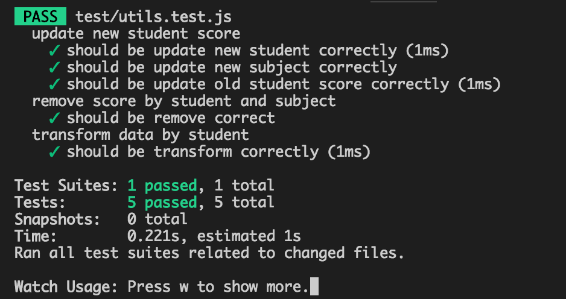

## I.  ออกแบบ UI และ Layout สถานะ Success

ดูผลลัพธ์ได้ที่ https://appmantest.herokuapp.com/


หรือจะดูผลการทำงานผ่านโค้ด
ก็ Run Server ก่อนด้วย Command
```
$ npm run server
```
จากนั้นก็ Run React Client ด้วย Command

$ npm run client // open localhost:8080
```
 


## II. UI Component & Service สถานะ Success

ในส่วนนี้จากโจทย์บอกให้แสดงผลดังภาพ
(โจทย์,ภาพ : https://github.com/thirawutp/appman-exam)

เลยเข้าใจว่าให้เอา msg ของ response มาแสดงใช่หรือไม่
ถ้าไม่ได้ status code 200 ก็จะแสดง error msg ตามที่ API ส่งกลับมา


## III. JS & Unit Test สถานะ Ambiguous

ส่วนนี้ผมสงสัยว่าโจทย์จะผิด

ให้ผมทำ test โดยให้ได้ผลลัพธ์ดังภาพ


คือต้องให้ผ่าน 5 test
โดยการ เปิดไฟล์ /utils/index.js เพื่อทำการเขียน function

ให้ผมทำ login แต่ให้ไป test เรื่องคะแนนของเด็กนักเรียน
เลยไม่ทราบว่าต้องการให้ผมเขียน test case เองทั้งหมดใหม่หรือว่ายังไง

เพราะคะแนนใน part นี้
- Pass 5 cases (15 คะแนน) 
- Logic (15 คะแนน)
- Code style (10 คะแนน)

เลยคาดว่าจะแก้โจทย์มาไม่หมด เพราะผมคงได้ part นี้เต็มถ้าปล่อยผม test เรื่อยเปื่อย

ขอบคุณครับ
